# BeerLicious

BeerLisious is the website for a fictive beer club located in the city of Helsingborg, Sweden. The club aim to encourage other beer interested people in the area to meet up and share social activities, learn from each other and just enjoy a relaxed gathering with like-minded beer lovers. This site targets various kinds of people whom are interested in knowing more about the crafting och know how of beer together, not the alcohol aspect of the brew.
 
 
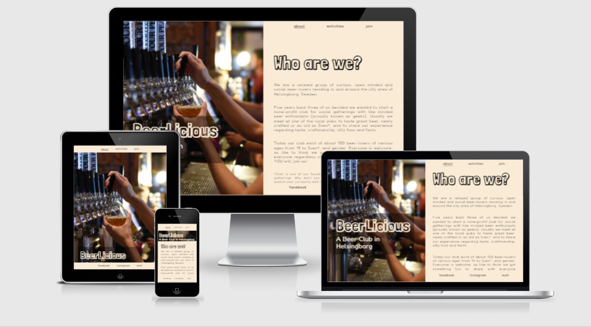
 

## Design

### Wireframes
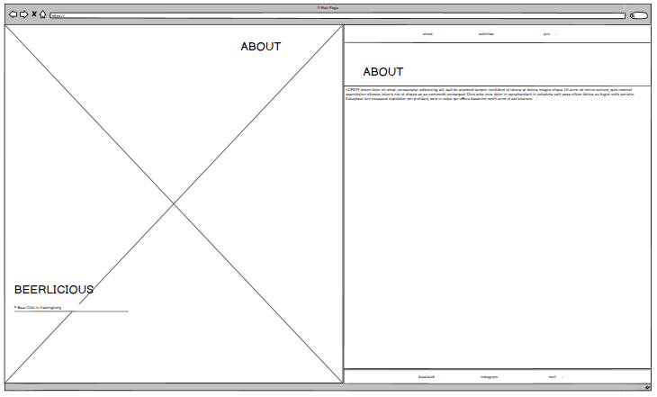      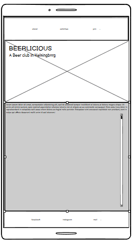
 
 

### User experince (UX)

### Design
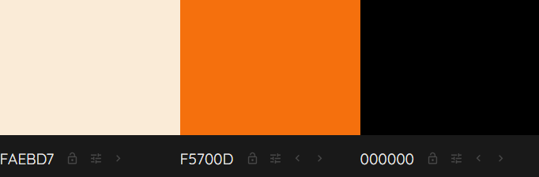

For the main page I wanted a design that makes the user think about an opend book or magazine.

## Features

### Existing Features

- Navigation Bar 
 
At the top of the right side of the webpage there is an internal navigation bar that marks the current page. It will help the user choose between the about page (home page), activites page and the sign up page - also know as "join".
 
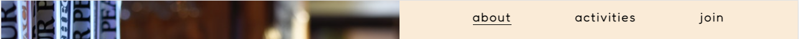
 
 
Hero Image  
As part of the main design there is a "hero image" to the left of the page a desktop and tablets with a screen at 1200px or above. The same image will transform as a header image at viewports the scale of 1200px and below. The image main purpose is to  work as a mode setter and in itself subconsciously get the user to associate the site with beer. Visually it will work as a complement to the text section but if the image won't load there is a background image in a contrasting color that connects to the color scheme of the entire web page.
 
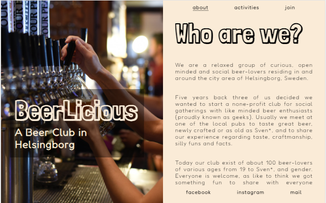     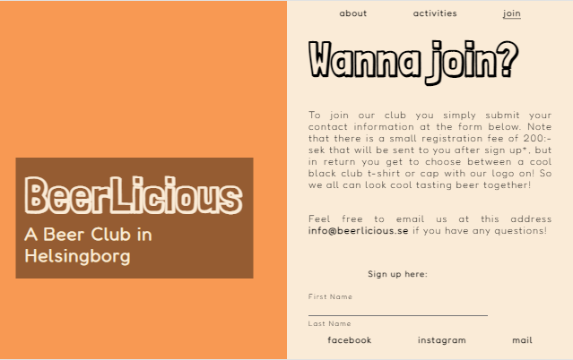
 
 
 About page
 
The main page aka the about page gives the user a short introduction to the club, who they are, why it started and it also tries to give a general feeling about the lightnes and humor of the gathering group while being infrormative. The main design team of the page was to make it easy to read, sleek in the design and yet introduce the user to the club and it's purpose. 
 
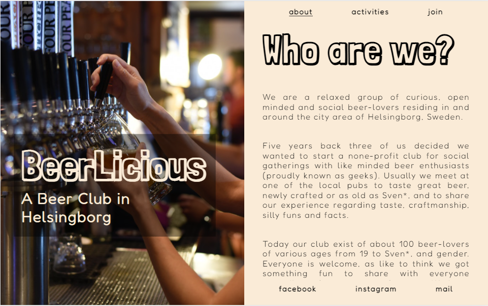
 
 
Activities page
Form page
External Links

## Testing
W3C HTML and CSS Validation
 
Lighthouse in Chroome DevTools
 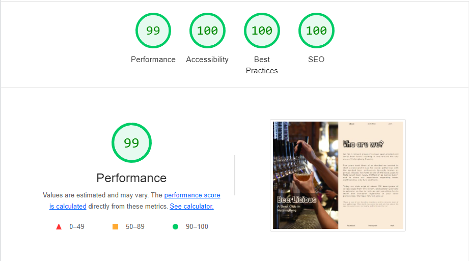
 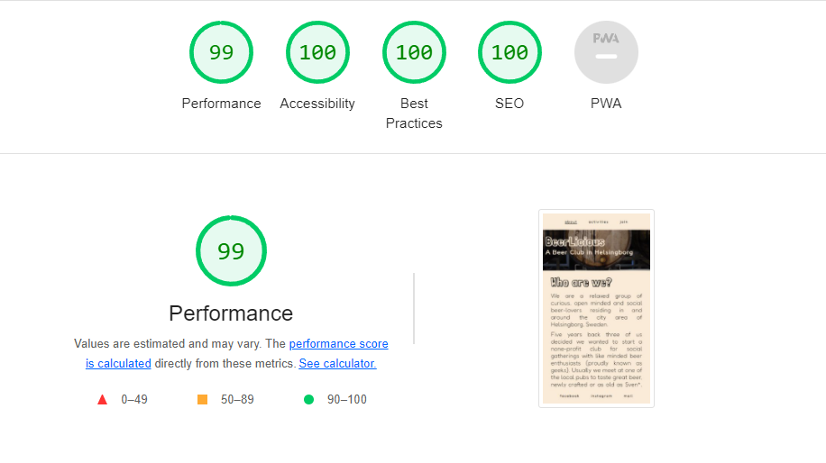
 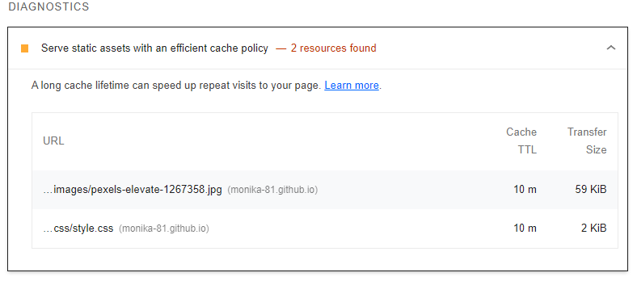

## Deployment

## Credits
I consulted
<li> the <a href="https://fontawesome.com/">Font Awesome</a> website about how to mark font icons for better accessibility.
<li> <a href="stackoverflow.com">stackoverflow.com</a> for help to hide the horizontal <a href="https://stackoverflow.com/questions/16670931/hide-scroll-bar-but-while-still-being-able-to-scroll">scrollbar</a>:
  ::-webkit-scrollbar {
  display: none;
 }
<li>as well as how to change input color for my <a hrwf="https://stackoverflow.com/questions/4253920/how-do-i-change-the-color-of-radio-buttons">radion buttons</a> in the sign up form:
 input[type='radio'] { accent-color: #000; }
<li> To tackle the autofill input color in the form i consulted <a href="https://css-tricks.com/snippets/css/change-autocomplete-styles-webkit-browsers/">CSS-tricks.com</a>.
 All three codes was tested through the live server in chrome before commited to style.css. 

### Content
<li> Fun fact quote underneet the activities list on page two was taken from an article about International Beer Day 2021 in <a href="https://www.indiatimes.com/trending/social-relevance/international-beer-day-facts-about-beer-546635.html">Indiatimes.com</a>
<li> The beer mug icon on the same page are from <a href="https://fontawesome.com/">Font Awesome</a>.

### Media
<li> The hero images comes from the artist ELEVATE at <a href="https://www.pexels.com/sv-se/@elevate">Pexels.com</a>.