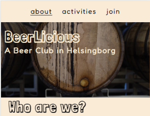

# BeerLicious

BeerLicious is the website for a fictive beer club located in the city of Helsingborg, Sweden. The club aim to encourage other beer interested people in the area to meet up and share social activities, learn from each other and just enjoy a relaxed gathering with like-minded beer lovers. This site targets various kinds of people whom are interested in knowing more about the different kinds of, the crafting procedure and know how of beer together, not the alcohol aspect of the brew.
 
 

 

## Content
1 - [Design](#design)
---

## Design

 
### Design choices: The layout
 

The idea for the BeerLicious main page design for desktop aims to get the user to think about an open book or magazine, like a "club broschure". With a decorative image to the left to set the mode as well as visually inform the user what the page is about. For standing devises the image is instead set at the top to welcome the user. 

- Wireframes
  
The initial design was schetched with pen and paper but later transformed to wireframes for a cleaner visual approched of the end result. The desktop version shows the main design goal of the split screen display. The split screen display was also added to the mobile screen in landscape position for a consistent design. For tablet format the mobile wireframe was slightly changed with a bigger hero image to welcome the user. But overall the main design idea was keept throughout the project.
 

 
 
 

### Design choises: Hero Image
 

I wanted the story of the page to start on the left hand side with an images that informes the user of what sort of content to expect. The overall design of the picture needed to be a darker setting to contrast the lighter text block of the screen. Also i wanted the larger picture to contain a beer class with a color that was connected to the accent color of the project. Two diffrent pictures was choosen for diffrent screen alignment, one for desktop and lanscape view and one for smaller standing devises. The smaller picture on smaller screen where also choose to make the site more responsive.

  

### Design choises: Color scheme
   

The goal of the design is to keep a clean and consistant user experience troughout the pages. With a light background/dark text set up and one accent color that associates the user with beer and wich also could be found in the main hero image. The color was picked using Chroome DevTools color picker tool, then adjusted slightly so the text would still be readable if the image won't load. A color scheme was created using Colormind to work as a design foundation during the project.

The color scheme below shows the color in hex-code but rgba was used in the css for consistency purpose.

 

 
 

The color inspiration in the main image:

The accent color can be seen while hovering over one of the links on the page, the email address or over the submit button:

 

   

---
 

 

## Features
 

### Existing Features
 

- Navigation Bar 
 
At the top of the website there is an internal navigation bar that will help the user choose between the "about page" (home page), "activites page" and the "sign up page" - also know as "join". The current page is also marked for an easier understanding of what page the user is currently seeing. On desktop and lanscape oriented screens the navigation bar is located to the top right side of the page, and on standing devices the navigation bar is fixed at the top of the screen.
 
 

  
 
 
- Hero Image  
As part of the main design there is a "hero image" to the left of the page a desktop and screens in lanscape position. The same image will transform as a header image at viewports the scale of 1200px down too 600px when a smaller image will serve as the hero image. The image main purpose is to  work as a mode setter and in itself subconsciously get the user to associate the site with beer. Visually it will work as a complement to the text section but if the image won't load there is a background color in the accent color that connects to the color scheme of the entire web page. The logo "BeerLicious" that rest ontop off the hero image acts both as an title to the entire page but also works as a internal link to the about page of the site. Giving the user the option to also interact with the image text to take them back to the home page.   
 

   
 
 
 - About page
 
The main page aka the "about page" gives the user a short introduction to the club, who they are, why they started the club and it also tries to give a general feeling about the lightness and humor of the gathering group while being informative. The main design team of the page was to make it easy to read, sleek in the design and yet introduce the user to the club and it's purpose. 
 

 

- Activities page
 
For more information on what sort of activies a potential new memebr of the club could come to expect from BeerLicious, the user finds a list of exampel activities on this page. To set the tone of the club there is a fun facts quote at the end of the page with an external link to [Indiatimes.com](https://www.indiatimes.com/trending/social-relevance/international-beer-day-facts-about-beer-546635.html) where the fact was borrowed from. The link to the external page serves to credit the orignal writer of the article. 
 

 

- Form page
 
At the "join" page the user cget instructions to how to sign up, the cost of signing up and that as a compensation the new member gets a club t-shirt or cap with the BeerLicious logo. On the same page there is a way to contact the club without signing up first. The form requires all fields to have the correct input before the form can be sent. When the user hover over the submit button, it changes color to the accent color of the design.
 

  
 

- Confirmation page
 
After the user have submitted the form the user is greated with a confirmation page, informing the user that he or she will be contacted shortly. 
 

 

- External Links
 
At the end bottom of the site, the user finds the external navigation links to social media as well as to open a mail client to send a mail to the BeerLicios club directly. The position of the navbar at the bottom mimics the navbar at the top of the page. On desktop and lanscape oriented screens the navigation bar is located to the bottom right side of the page, and on standing devices the navigation bar is fixed at the bottom of the screen.
 

## Technologies
- HTML5
- CSS3
- Balsamiq
- Colormind
- GitPod
- GitHub
- DevTools

## Testing
W3C HTML and CSS Validation
 
When the basic structure of the project was done I ran code validation through W3S Validator for all HTML files as well as the CSS file. This procedure was repeated multiple times to validate that the code was working. I also ran the page through Lighthouse for both desktop and mobile to test out the performance and assessibility of the page. The input gave me further information how to proceed with the project, and was repeated after major changes and bug fixes. The same validation and assessibility testing was used at the end of the project. The final result is shown below: 
 

 
 Lighthouse in Chroome DevTools

 

## Deployment
 
- The project was deployed to GitHub using GitPod and 

## Credits
- The BeerLicious prodject was developed using GitPod and Code institutes template.

I consulted
- the [Font Awesome](https://fontawesome.com) website about how to mark font icons for better accessibility.
- Stack overflow for help to hide the horizontal [scrollbar](https://stackoverflow.com/questions/16670931/hide-scroll-bar-but-while-still-being-able-to-scroll) as well as how to change input color for my [radion buttons](https://stackoverflow.com/questions/4253920/how-do-i-change-the-color-of-radio-buttons) in the sign up form.
- To tackle the autofill input color in the form I consulted [CSS-tricks.com](https://css-tricks.com/snippets/css/change-autocomplete-styles-webkit-browsers/).
 All three codes was tested through the live server in chrome before commited to style.css. 
 
 
- Fonts comes from Google fonts
- Icon comes from Font Awesome
- Color scheme was created using Colormind
- DevTools

### Content
- Fun fact quote underneet the activities list on page two was taken from an article about International Beer Day 2021 in [Indiatimes.com](https://www.indiatimes.com/trending/social-relevance/international-beer-day-facts-about-beer-546635.html).
- The beer mug icon on the same page are from [Font Awesome](https://fontawesome.com/).

### Media
- The hero images for both lanscape and standing view of the screen comes from the artist ELEVATE at [Pexels.com](https://www.pexels.com/sv-se/@elevate).