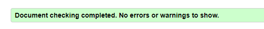
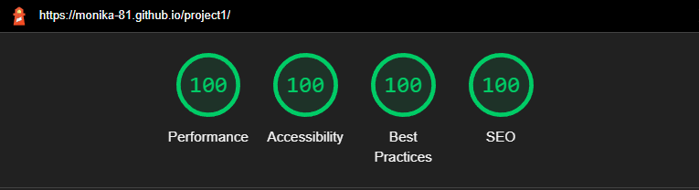
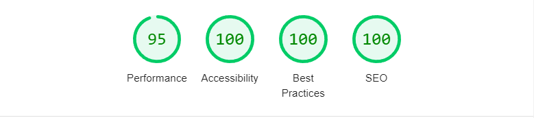

# **BeerLicious**

**BeerLicious** is the website for a fictive beer club located in the city of Helsingborg, Sweden. The club aim to encourage other beer interested people in the area to meet up and share social activities, learn from each other and just enjoy a relaxed gathering with like-minded beer lovers. This site targets various kinds of people whom are interested in knowing more about the different kinds of, the crafting procedure and know how of beer together, not the alcohol aspect of the brew. 

Let me introduce you further to [**BeerLicious**](https://monika-81.github.io/project1/).
 
 

 

---
## **Content**
1.

2. [**Design**](#design)
    - [The layout](#the-layout)
    - [Hero Image](#hero-image)
    - [Color scheme](#color-scheme)
    - [Fonts](#fonts)

3. [**Features**](#features)
    - [Navigation bar](#navigation-bar)
    - [Hero Image](#hero-image)
    - [About page](#about-page)
    - [Activities page](#activities-page)
    - [Join page](#join-page)
    - [Confirmation page](#confirmation-page)
    - [External links](#external-links)

4. [**Technologies**](#technologies)

5. [**Testing**](#testing)
    - [Bugs and fixes](#bugs-and-fixes)

6. [**Deployment**](#deployment)

7. [**Credits**](#credits)
    - [Content](#content)
    - [Media](#media)
    - [Aknowledgement](#aknowledgement)

    
---

## **Design**

 

### **The layout**
The design choice for the BeerLicious main page for desktop aims to get the user to think about an open book or magazine, like looking at a "club broschure" thrugh a screen. With a decorative image to the left to set the mode as well as visually inform the user what the site is about. For standing devises the image is instead set at the top to welcome the user.

- **Wireframes**
  Initially the design idea was schetched ocu with pen and paper and thereafter transformed to basic wireframes for a clearer visual approched of the end result. The desktop version shows the main design goal of the split screen display. The split screen display was also added to the mobile screen in landscape position for a consistent design. For tablet format the mobile wireframe was slightly changed with a bigger hero image to welcome the user. But overall the main design idea was keept throughout the project.

 
 
 

### **Hero Image**
With the BeerLicious website I wanted the story of the site to start on the left hand side with an images that visually informes the user of what sort of content to expect. The overall design of the picture needed to be a darker setting to contrast the lighter text block to the right of the screen. The idea was to combine the color nuances of the hero image with the color theme, so the larger picture contains a beer class with a color that was similar to the accent color idea of the project. Two diffrent pictures was choosen for diffrent screen alignment, one for desktop and lanscape view and one for smaller standing devises. A smaller picture on a smaller screen also makes the site more responsive.

  
 

### **Color scheme**
The goal of the design is to keep a clean and consistant user experience troughout the pages. With a light background/dark text set up and one accent color that associates the user with beer. The color was picked from the hero image using Chroome DevTools color dropper tool, then adjusted slightly so the text would still be readable if the image won't load. A color palette was created with the help of [Colormind](http://www.colormind.io) to work as a design foundation during the project.

The color scheme below shows the color in hex-code but rgba was used in the css for consistency purpose.
 

 
 

The color inspiration in the main image:

 
 

The accent color can be seen while hovering over one of the links on the page, the email address or over the submit button:

  

 

### **Fonts**
BeerLicious site want the user to get a taste of the lightheartedness and humor of the club. In line with that the fonts for the project was choosen to be playful. 
- The first font "Londrina Shadow" is used for the main titles. Both for the club logo and as a title for each page. 
- The second font "Fredoka" is the font used for the rest of the text content. But for the text underneath the BeerLicius club name as well as for all the article and list text.

 
 

---

## **Features**

 

### **Navigation bar**
At the top of the website there is an internal navigation bar that will help the user choose between the "about page" (home page), "activites page" and the "sign up page" - also know as "join". The current page the user is visiting is marked for easier navigation on the site. On desktop and lanscape oriented screens the navigation bar is located to the top right side of the page, and on standing devices the navigation bar is fixed at the top of the screen.
 

 
 
 

### **Hero Image** 
As part of the main design there is a "hero image" to the left of the page at desktop and screens in lanscape position. The same image will transform as a header image at viewports the scale of 1200px down to 600px wherafter a smaller image will serve as the hero image. The image main purpose is to set the mode and in itself get the user to associate the site with beer. Visually it will work as a complement to the text section but if the image won't load there is a background color in the accent color that connects to the color scheme of the entire web page. The logo "BeerLicious" that rest ontop off the hero image acts both as an title to the entire page but also works as a internal link to the home page of the site. Giving the user the option to interact with the image text to take them back to the home page.   
 

    
 
 

### **About page**
The home page a.k.a. the "about page" gives the user a short introduction to the club, who they are and why they started the club. The information text is slightly humoristic to give a general feeling about the lightheartedness and humor of the gathering group while still being informative. The main design theme of the page was to make it easy to read, sleek in the design and yet introduce the user to the club and it's purpose. 
 

 
 

### **Activities page**
For more information on what sort of activies a potential new memebr of the club could come to expect from BeerLicious, the user finds a list of exampel activities on the activities page. To keep up with the tone set on the home page, there is a fun facts quote at the end of the page with an external link to [Indiatimes.com](https://www.indiatimes.com/trending/social-relevance/international-beer-day-facts-about-beer-546635.html) where the fact was borrowed. The link to the external page serves to credit the orignal writer of the article and to give the user the choice to read up on more fun facts. 
 

 
 

### **Join page**
The "join" page gives the user instructions on how to sign up for BeerLicious, the cost of membership and also informes the user that he or she will recive a club t-shirt or cap with the BeerLicious logo if the decide to join. The page includes the email address for any further questions and doesn't require the user to sign up first. The user can either click the link to open an external web client or copy the address and open their preferred email client to sent an emil. The sign up form requires all fields to have the correct input before the form can be sent. When the user hover over the submit button, it changes color to the accent color of the design.
 

  
 
 

### **Confirmation page**
After the user have succesfully submitted the form the user is greated with a confirmation page, informing the user that he or she will be contacted shortly. 
 

 
 

### **External Links**
At the bottom of the screen, the user finds the external navigation links to social media as well as to open a mail client to send an email to the BeerLicios club directly. The position of the navigation bar at the bottom mimics the navigation bar at the top of the page. On desktop and lanscape oriented screens the navigation bar is located to the bottom right side of the page, and on standing devices the navigation bar is fixed at the bottom of the screen.
 

 
 

---

## **Technologies**

 

### **Languages**
- HTML5
- CSS3

### **Tools**
- [Balsamiq](https://balsamiq.com/)
- [Colormind](http://www.colormind.io)
- [DevTools](https://developer.chrome.com/docs/devtools/)
- [Font Awesome](https://fontawesome.com)
- [GitPod](https://www.gitpod.io/)
- [GitHub](https://github.com/)
- [Google Fonts](https://fonts.google.com/)
 

---

## **Testing**
 

### **Manual testing**

During the entire developing stage I repeatadly tested the elements added and altered regarding appearance as well as responsivness via the simulated live server GitPod provides. After the site was live deployed I also checked the site regulary trough my smartphone for first hand uppdates on a live mobile viewport.

- [DevTools](https://developer.chrome.com/docs/devtools/)
 

In combination with the direct visual view of the page provided by the live server I frequently used Google Chrome developer tools, both for direct changes of the code as well as the tools for responsive testing of diffrent platforms and screen sizes.

- [Am I responsive?](http://ami.responsivedesign.is/)
 

To get a second opionon of how the site worked in regard to diffrent screen sizes, I checked the result at "Am I Responsive?"
 

### **Code validation**
 

- [HTML and CSS Validation](https://www.w3schools.com/) 
 

When the basic structure of the project was done I ran code validation through W3Schools Validator for all the HTML files as well as the CSS file. This procedure was repeated multiple times to validate that the code was working during the developing process. 

- [Lighthouse](https://developers.google.com/web/tools/lighthouse)

I also ran the page through Lighthouse for both desktop and mobile to test out the performance and assessibility of the page. The input gave me further information how to proceed with the project, and was repeated after major changes and bug fixes. 
 

Both platforms where used for validation and assessibility testing at the final stage of the project. The final result is shown below: 
 
 

**W3School**

 
 
 

**Lighthouse** 

(The same result on all pages)
 
 

(The mobile performance of 95% occured on the activities page due to the image loaded, while running the same test on the other pages of the site the rating was 99%.)
 
 

### **Bugs and fixes**
There where a number of bugs and misshaps commited throught the development as I tried to learn the best way to code the website. 
Some of those bugs (that are now fixed) where:
- The hero image didn't fit the intended content area.
- Image text didn't stay where it was intended while testing the sites responsiveness.
- The sticky header and footer had text scrolling underneath or the text was not visible due to the said header and footer.
- The links in the header and footer was overshadow by the neighbouring links padding and didn't work on smaller screens.
- The hero image was too big on tablet screen size, covered the whole viewport window.
- Lighthouse flagged the indiatimes.com link as bad SEO due to the inital test around the link was none descriptive of the links purpose.
- Due to large images and split screen design, the media query adjustments required a lot of trial and errors remodelling before the result was ok on all of the devices testable by chroome DevTools. Both in standing and landscape mood.
- The imagetext was not contrasting enough against the hero image, an overlay was added.
- The text segment didn't scroll as wanted.

There are also a few bugs left to fix that won't respond as I wish at the moment. Even though I tried to fix it, there is always room for improvement and as I learn to become a better developer, I look forward to in the future fix:
- There is areas of blank space on the home page and activities page while the screen is in standing position. As I've tried to fix it so far, the area on the join page has either partly been covered by the footer ocr "double scrolled" in under the hero image.
- While the site is responsive, it is still to static in the site transformation. I would like it to be more flexible.
- I'd also like to add a live calender section and a page where the club members can order club merchandise. 
 

---

## **Deployment**
 

The project was deployed to **GitHub** using **GitPod**:
- Go to the projects repository page at GitHub.
- Go to *settings* in the upper menu, and then choose *pages* in the left-hand menu.
- Under the Source section, select the *Main branch* from the drop-down menu and click Save.
- On top of the screen there will be a massage displayed with the active link.
 

---

## **Credits**

 

### **Content**
- Fun fact quote underneath the activities list on page two was taken from an article about International Beer Day 2021 in [Indiatimes.com](https://www.indiatimes.com/trending/social-relevance/international-beer-day-facts-about-beer-546635.html).
- The color palette was created using [Colormind](http://www.colormind.io)
- The [Fredoka](https://fonts.google.com/specimen/Fredoka?query=fredok) and [Londrina Shadow](https://fonts.google.com/specimen/Londrina+Shadow?query=londrina) fonts come from [Google Fonts](https://fonts.google.com/).
 

I consulted following sites for help with code design:
- the [Font Awesome](https://fontawesome.com) website about how to mark font icons for better accessibility.
- Stack overflow for help to hide the horizontal [scrollbar](https://stackoverflow.com/questions/16670931/hide-scroll-bar-but-while-still-being-able-to-scroll) as well as how to change input color for my [radion buttons](https://stackoverflow.com/questions/4253920/how-do-i-change-the-color-of-radio-buttons) in the sign up form.
- To tackle the autofill input color in the form I consulted [CSS-tricks.com](https://css-tricks.com/snippets/css/change-autocomplete-styles-webkit-browsers/).
 All three codes was tested through the live server in chrome before commited to style.css. 
 
 
- Fonts comes from Google fonts

### **Media**
- The hero images for both lanscape and standing view of the screen comes from the artist ELEVATE at [Pexels.com](https://www.pexels.com/sv-se/@elevate).
- The beer mug icon on the same page are from [Font Awesome](https://fontawesome.com/).
 

---

