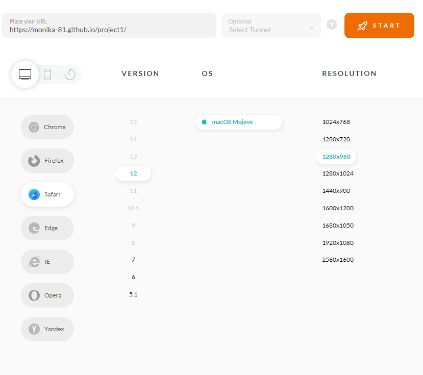
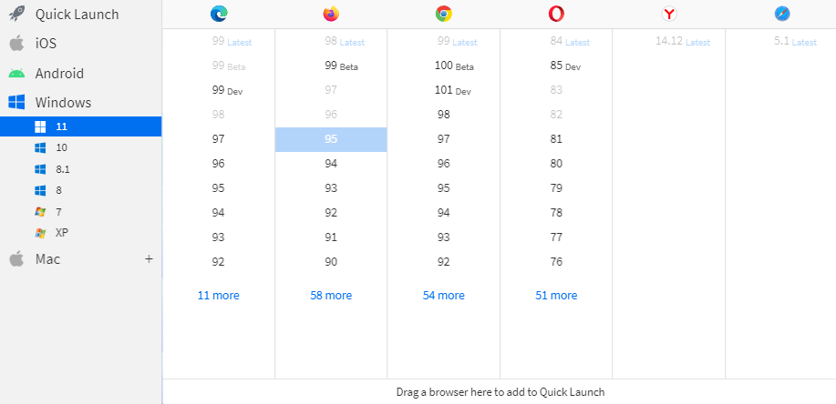
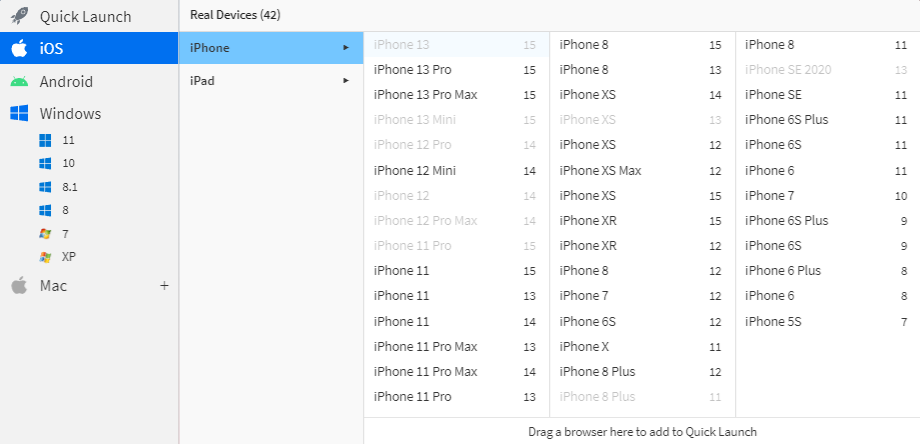
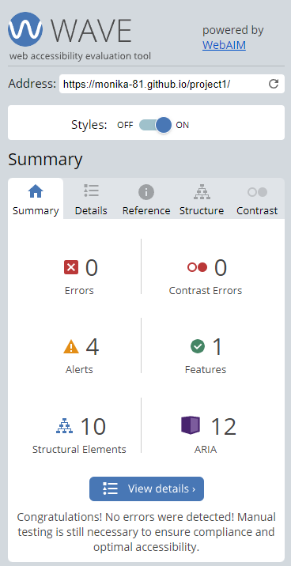
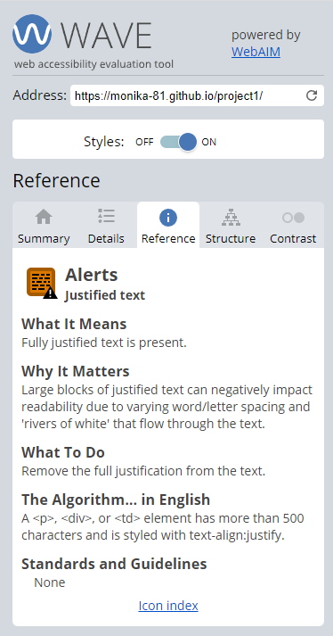

# **Testing**

1. [Manual testing](#manual-testing)
    - Responsive Design Checker
    - DevTools
    - Am I responsive?
    - Lamda Test
    - BrowserStack
2. [Code validation](#code-validation)
    - W3Schools
        - HTML
        - CSS
    - Lighthouse
    - WAVE
3. [Bugs and fixes](#bugs-and-fixes)

---

### **Manual testing**

During the entire developing stage I repeatedly tested the elements added and altered regarding appearance as well as responsiveness via the simulated live server GitPod provides. After the site was live deployed I also checked the site regularly trough my smartphone for first hand updates on a live mobile viewport.

 

- [Responsive Design Checker](https://responsivedesignchecker.com)
- [DevTools](https://developer.chrome.com/docs/devtools/)

In combination with the direct visual view of the page provided by the live server I frequently used Google Chrome developer tools, both for direct changes of the code as well as the tools for responsive testing of different platforms and screen sizes. As a compliment to DevTools I also checked how the website responded on diffrent screen sizes and screen orientaion using Responsive Design Checker. The final version of website passed all the visual and functional apperences changes on both large and small screens as well as the change between landscape and portrait orientaion changes on the same device. For example of how the same mobile screen funtions in both orientations, see below.

 

 

 

- [Am I responsive?](http://ami.responsivedesign.is/)

To get a second opinion of how the site worked in regard to different screen sizes, I checked the result at "Am I Responsive?" The result is shown as a screenshot at the [introduction](./README.md) of the project.

 

- [Lambdatest](https://lambdatest.com)
- [Browserstack](https://browserstack.com)

The websites compatability to various browsers (Chrome, Safari, Opera, Firefox, Internet Explorer, Edge, WC Browser and Yandex) including diffrent versions of said browsers, was tested using the Lamda Test application as well as BrowserStack on both desktop and mobile. Diffrent mobile versions was tested also for diffrent browsers. Over all the appearance, functionality and responsiveness were consistent throughout for most of the devices and browsers. The notable diffrence in apperence I found was that the scrollbar are not hidden in Firefox and Internet Explorer for desktop. And on mobile the safari browser enlarged the form size the scewed the design, also the safari browser allowed for input data to be sent without all the required fields. Exampels of tested platforms is shown below.

 

  

 

[Back to top](#testing)

---

### **Code validation**
 

- [HTML and CSS Validation](https://www.w3schools.com/) 

When the basic structure of the project was done I ran code validation through W3Schools Validator for all the HTML files as well as the CSS file. This procedure was repeated multiple times to validate that the code was working during the developing process. Nothing major was found while testing besides a few aria-labels attached wrongly.
 

- [Lighthouse](https://developers.google.com/web/tools/lighthouse)

I also ran the page through Lighthouse for both desktop and mobile to test out the performance and accessibility of the page. The input gave me further information how to proceed with the project, and was repeated after all major changes and bug fixes. 
 

Both platforms where used for validation and accessibility testing at the final stage of the project. The final result is shown below: 
 
 

**W3School**

HTML 

 

CSS
 

 
 

**Lighthouse** 

 
(Desktop, the same result on all pages.)
 
 

 
(The mobile performance of 95% occurred on the activities page due to the image loaded, while running the same test on the other pages of the site the rating was 99%.)
 
 

- [WAVE](https://wave.webaim.org/)

To validate the accessibility further I also tested the site at Wave - Web Accessibility Evaluation Tool. No errors where found and the four warnings are give to the paragraphs with justified text, but I decided to keep the justified text out of design choice.

 
 
 

[Back to top](#testing)

---

### **Bugs and fixes**
There where a number of bugs and mishaps committed through the development as I tried to learn the best way to code the website. Due to the large hero images and split screen design, the media query adjustments required a lot of trial and errors remodeling before the result was okay on all the devices. 

**The major bugs where**:  
1. The hero image didn't fit the intended content area on desktop, the background color was showing at the top and bottom of the image.
    - Fixed by revisiting the LMS material.
2. Image text didn't stay where it was intended while testing the site's responsiveness, especially when I turned the smaller screens for landscape position.
    - Fixed with the help of the media queries.
3. The sticky header and footer had text scrolling underneath or the text was not visible due to the said header and footer.
    - Fixed by revisiting the LMS material and by trying out own ideas.
4. The links in the header and footer was overshadowed by the neighboring links padding and didn't work on smaller screens.
    - Revisited the box-model lessons for better understanding. Changed padding to margin to keep the links at a distant from each other.
5. The hero image was too big on tablet screen size, covered the whole viewport window.
    - Resized the image and adjusted additional style in the media queries.
6. Lighthouse flagged the indiatimes.com link as bad SEO due to the initial text description around the link was none descriptive of the links purpose.
    - Rewrote the description containing the link.
7. Lighthouse also flagged the hero image for bad loading time which lowered the performance.
    - The image was to large, so a smaller version was downloaded and used instead. 
8. The image text was not contrasting enough against the hero image.
    - An overlay was added.
9. The text segment didn't scroll as wanted.
    - Revisited the lesson about overflow and added the property where it was needed.

 

For most of the bug fixes I went back to the [Code Institute](https://codeinstitute.net/) LMS and the learning material for the HTML ans CSS module and found the answers there. I also turned to the Slack community and the search function, where I found many answers. In a few cases I consulted external sources while searching for the answer using [Google](www.google.com). For more information about the external code used, see the section on the previous page.

 

**Bugs not fixed**:
- Areas of blank space on the home page and activities page when the screen is portrait oriented. My attempts to fix it so far resulted in that the equivalent area on the *join page* has either partly covered by the footer or "double scrolling" in under the hero image.
- The code I found on Stack Overflow to help me hide the scrollbar doesn't work in Internet Explorer and Firefox. There are other code examples on the same site but for this site I didn't want to include JavaScript.
 

[Back to top](#testing)

---